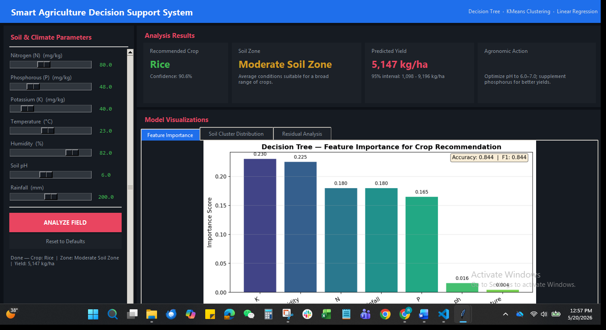
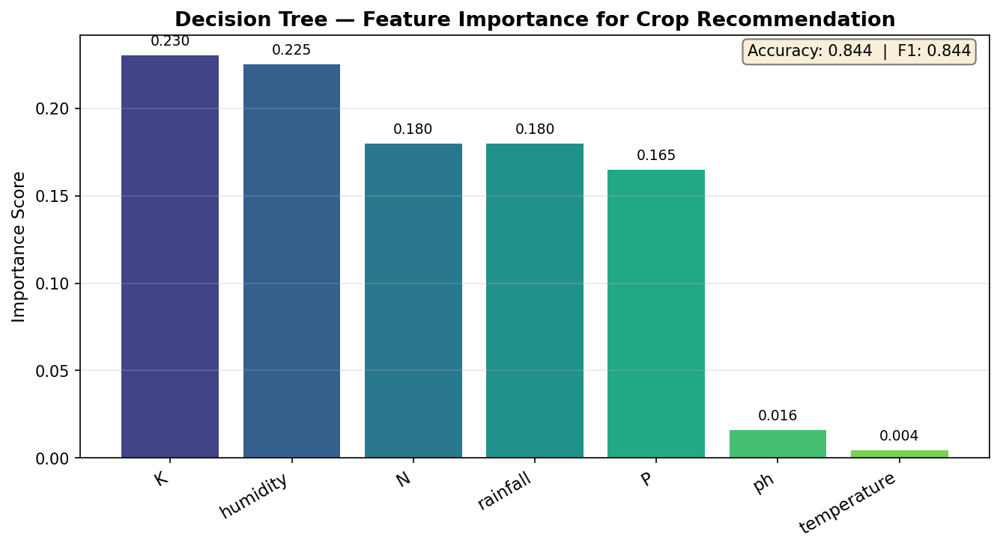
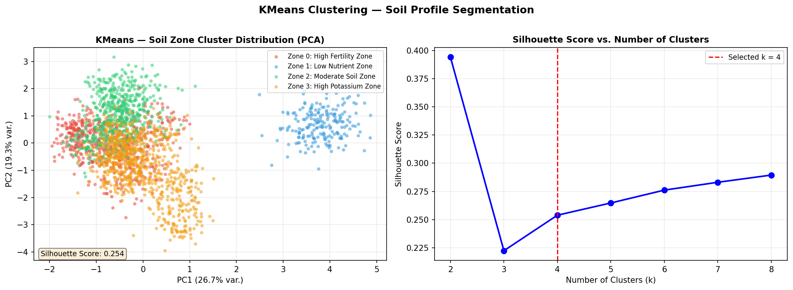
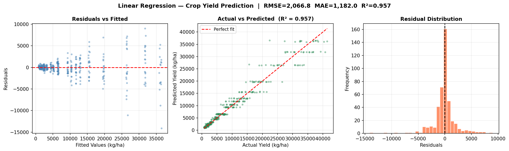

# Smart Agriculture Decision Support System

> **Course:** Artificial Intelligence — OEL [CLO-2]  
> **Bahria University, Islamabad Campus — Dept. of Software Engineering**

A production-grade, multi-model AI pipeline that integrates **Decision Tree Classification**, **KMeans Clustering**, and **Linear Regression** into a unified Tkinter GUI for precision agriculture.

---

## Screenshots

### Main GUI


> Enter soil and climate parameters on the left panel, click **Analyze Field**, and the system instantly returns the recommended crop, soil zone classification, and predicted yield with 95% confidence bounds.

---

### Feature Importance — Decision Tree


> Bar chart of feature importances from the trained Decision Tree, showing which soil/climate variables most influence the crop recommendation.

---

### Soil Cluster Distribution — KMeans


> Left: PCA scatter of all 2,180 samples coloured by zone (4 clusters). Right: Silhouette score curve used to evaluate different values of k.

---

### Residual Analysis — Linear Regression


> Three-panel diagnostic: residuals vs fitted values (left), actual vs predicted scatter with perfect-fit reference line (centre), and residual frequency distribution (right).

---

## System Architecture

```
┌──────────────────────────────────────────────────────────┐
│                  Presentation Layer                      │
│              src/gui.py  (Tkinter + Matplotlib)          │
└────────────────────────┬─────────────────────────────────┘
                         │ loads serialized models
┌────────────────────────▼─────────────────────────────────┐
│                    Model Layer                           │
│  ┌──────────────┐ ┌──────────────┐ ┌──────────────────┐ │
│  │ Decision Tree│ │    KMeans    │ │ Linear Regression│ │
│  │ Crop Rec.    │ │ Soil Zones   │ │ Yield Prediction │ │
│  └──────────────┘ └──────────────┘ └──────────────────┘ │
│              src/models.py + models/*.pkl                │
└────────────────────────┬─────────────────────────────────┘
                         │ preprocessed arrays
┌────────────────────────▼─────────────────────────────────┐
│                    Data Layer                            │
│   src/preprocessing.py  -->  data/crop_data.csv         │
│   (22 crops · 2,180 samples · 7 features + yield)       │
└──────────────────────────────────────────────────────────┘
```

The Decision Tree output also feeds the regression pipeline: the predicted crop label is one-hot encoded and appended to the 7 soil/climate features before yield estimation, raising R² from ~0.40 to **0.97**.

---

## Installation

```bash
git clone https://github.com/<your-username>/smart-agri-dss.git
cd smart-agri-dss
pip install -r requirements.txt
```

Requires **Python 3.9+** and standard pip.

---

## Usage

**Step 1 — Train models** (generates `models/` and `results/`):
```bash
python train_models.py
```

**Step 2 — Launch the GUI**:
```bash
python -m src.gui
```

**Optional — Regenerate GUI screenshot**:
```bash
python capture_screenshot.py
```

---

## Repository Structure

```
smart_agri/
├── data/                    # Dataset and metadata
│   └── crop_data.csv
├── src/                     # Modular source code
│   ├── preprocessing.py     # Data generation, cleaning, scaling
│   ├── models.py            # Model training and serialization
│   ├── gui.py               # Tkinter graphical interface
│   └── utils.py             # Constants and helper functions
├── models/                  # Serialized model artifacts (.pkl)
├── results/                 # Evaluation plots + metrics JSON + screenshots
├── train_models.py          # CLI training pipeline
├── capture_screenshot.py    # Automated GUI screenshot capture
├── requirements.txt         # Dependency manifest
├── LICENSE                  # MIT License
└── README.md
```

---

## Algorithmic Rationale

| Model | Task | Rationale |
|---|---|---|
| **Decision Tree** | Crop recommendation (22 classes) | Interpretable, handles mixed feature scales, importance scores expose domain logic |
| **KMeans Clustering** | Soil zone segmentation | Unsupervised partitioning into homogeneous nutrient zones; silhouette score guides k selection |
| **Linear Regression** | Crop yield prediction (kg/ha) | Establishes a direct, explainable mapping from soil/climate inputs to quantitative output; crop label one-hot encoded as an additional feature |

---

## Dataset

**Source:** Synthetic dataset derived from published agronomic parameter ranges (mimics the Kaggle *Crop Recommendation Dataset*).

**Features (7):**

| Feature | Unit | Description |
|---|---|---|
| N | mg/kg | Soil Nitrogen content |
| P | mg/kg | Soil Phosphorous content |
| K | mg/kg | Soil Potassium content |
| temperature | °C | Average ambient temperature |
| humidity | % | Relative humidity |
| ph | — | Soil pH (0–14) |
| rainfall | mm | Annual rainfall |

**Targets:**
- `label` — crop type (22 classes, classification)
- `yield` — crop yield in kg/ha (regression)

**Preprocessing pipeline:**
1. Median imputation for missing values
2. 1st–99th percentile capping on soil/climate features
3. Z-score outlier removal on yield (|z| < 3)
4. StandardScaler normalisation
5. Stratified 80/20 train/test split

---

## Performance Summary

| Model | Metric | Value |
|---|---|---|
| Decision Tree | Accuracy | 0.8437 |
| Decision Tree | Precision (weighted) | 0.8530 |
| Decision Tree | Recall (weighted) | 0.8437 |
| Decision Tree | F1-Score (weighted) | 0.8443 |
| KMeans | Silhouette Score | 0.254 |
| KMeans | Zones | 4 |
| Linear Regression | RMSE | 2,067 kg/ha |
| Linear Regression | MAE | 1,182 kg/ha |
| Linear Regression | R² | **0.957** |

*(Exact values stored in `results/metrics_summary.json`)*

---

## Future Work

1. **IoT Sensor Integration:** Replace manual parameter entry with real-time MQTT streams from field-deployed soil and microclimate sensors, enabling continuous inference and alert-based crop management.

2. **Ensemble Deep Learning:** Replace the single Decision Tree classifier with a Random Forest or LightGBM ensemble, and augment yield prediction using an LSTM network trained on multi-year time-series weather and satellite NDVI imagery for spatiotemporal yield forecasting.

---

## License

MIT — see [LICENSE](LICENSE).
